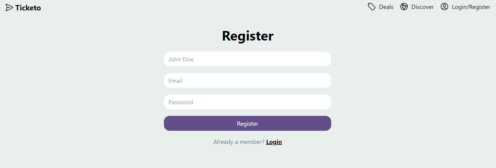
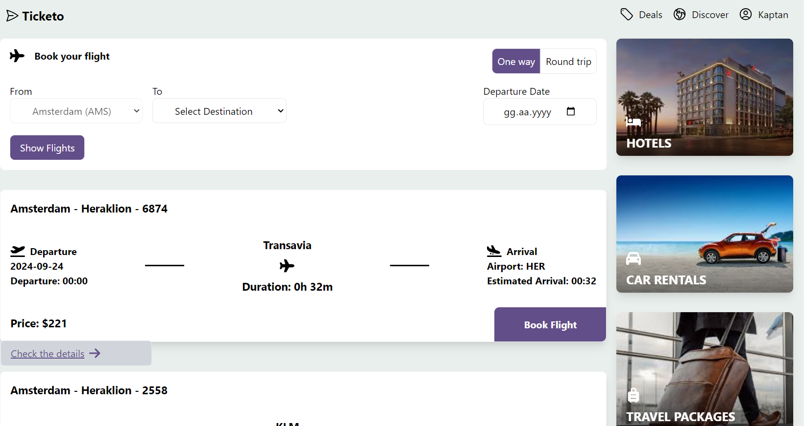
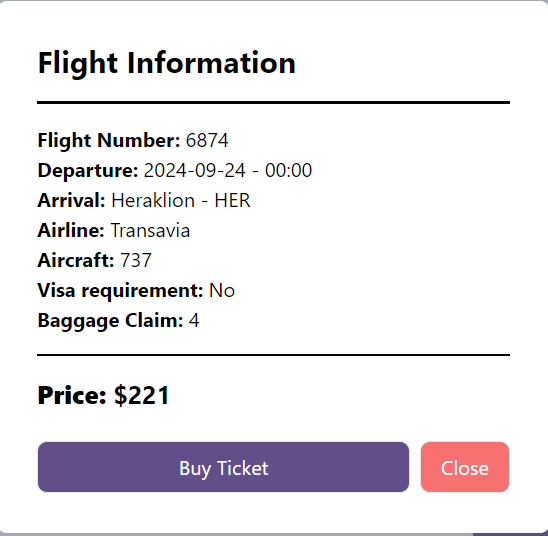
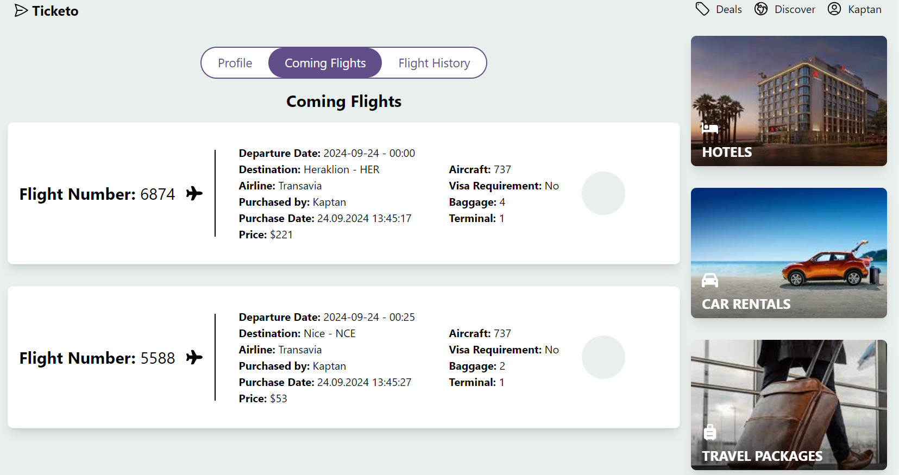

# Ticketo

Ticketo is an application for Schiphol Airport flight tickets. With this application, you can filter tickets by destinations. You can purchase the desired ticket and view your purchased tickets in your profile.

## Installation

After downloading the project, follow the steps below in the main folder:

### 1. Install Dependencies

```bash
yarn install
```
Then create 2 new terminals. One will be used for the backend and the other for the frontend.

### 1.1 Install Backend Dependencies
```bash
cd api
```
```bash
yarn install
```
Next, in the other terminal we opened, we will install the frontend dependencies.

### 1.2 Install Frontend Dependencies
```bash
cd client
```
```bash
yarn install
```
### 2. Run the Project
### 2.1 Start the Server First
Let's go back to the terminal we opened for the backend. Make sure we are inside the api directory.
```bash
node index.js
```
After doing this, you should see "Connected to MongoDB" in the console.

### 2.2 Run the Frontend 
Now, go to the terminal we opened for the frontend and run:

```bash
yarn dev
```
After this process, we can start using our application.







